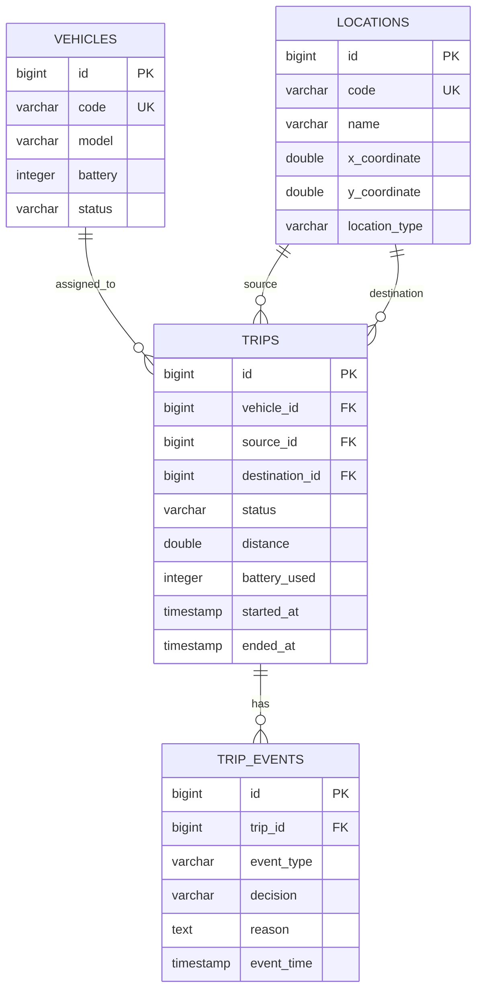

```mermaid
erDiagram
    VEHICLES ||--o{ TRIPS : assigned_to
    LOCATIONS ||--o{ TRIPS : source
    LOCATIONS ||--o{ TRIPS : destination
    TRIPS ||--o{ TRIP_EVENTS : has

    VEHICLES {
        bigint id PK
        varchar code UK
        varchar model
        integer battery
        varchar status
    }

    LOCATIONS {
        bigint id PK
        varchar code UK
        varchar name
        double x_coordinate
        double y_coordinate
        varchar location_type
    }

    TRIPS {
        bigint id PK
        bigint vehicle_id FK
        bigint source_id FK
        bigint destination_id FK
        varchar status
        double distance
        integer battery_used
        timestamp started_at
        timestamp ended_at
    }

    TRIP_EVENTS {
        bigint id PK
        bigint trip_id FK
        varchar event_type
        varchar decision
        text reason
        timestamp event_time
    }
```
